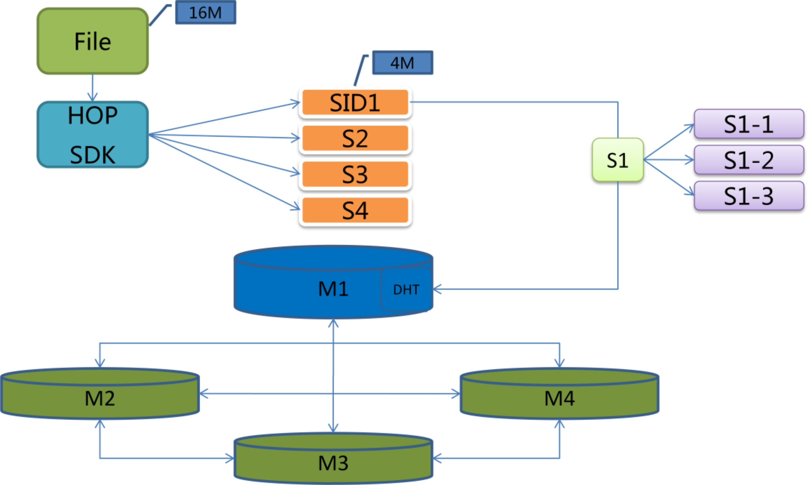
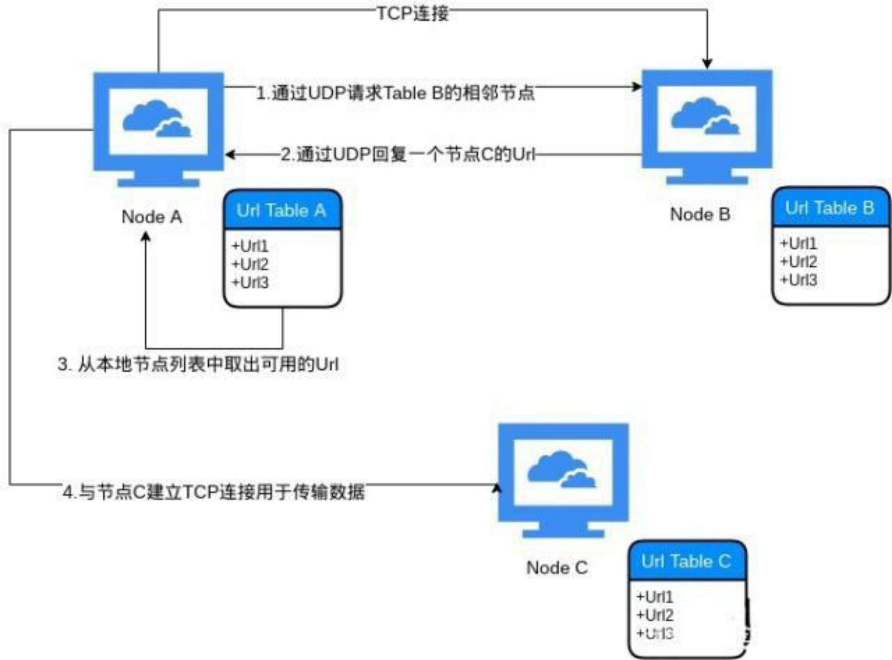

# 系统架构

## 数据存储层

HOP 以分布式流量共享为切入点，组件庞大的流量代理网络，该网络内容源自传统的互联网架构和中心化存储的设备。在现有的互联网基础架构下，网络数据分为两种，第一种是实时交互的数据，例如语音会议，视频直播，游戏； 第二种是非交互式数据，例如视频点播，网站浏览，云盘数据。对于第一种数据，HOP 通过流量代理网络为网络数据提供加密和脱敏防追踪的功能，而对于第二类流量数据，HOP 协议会依托现有的网络代理节点，组件分布式的文件存储系统。
该系统的基本原理如下：

对于任何视频数据、文件、可执行代码，HOP 会提供 SDK 或者完整的客户
端程序，对数据进行分片广播到 HOP 网络中，网络中的存储节点会以冗余的形
式存储该分片并供访问者使用。

## P2P网络层
HOP Protocol 采用全分布 P2P 节点可以自由加入退出，并且没有中心节点，节点地址没有结构化统一标准，整个网络结构呈随机图的结构，无固定网络结构图。然而完全的自由意味着新节点无法得知 P2P 网络节点信息，从而无法加入网络。全分布式 P2P 网络更加自由化的同时也带来节点管理的问题，节点频繁加入、退出使得整个网络结构无法稳定，大量的广播消息不仅造成资源浪费，甚至会阻塞网络。

对于处理区块链隐私性的问题，HOP Protocol 项目的解决方案是基于 P2P底层，架构 HOP Protocol 加密协议，在价值传输过程中，HOP 的硬件通过星链和流量设备提供稳定的算理系统，继而输出更多合规的算力值，并为不同网络建立可以双向流通的微支付通道，数字资产可以跨节点传输，减少相关主链的负荷。HOP Protocol 协议将网络中的数据包进行多次加密，网络中间层值能打开相应的加密层，这一层主要是展示这个包的传输节点及路由信息，这样就实现了在网络上隐藏详细的交易、文件传输等细节。

## 业务结算层

当业务服务层负责管理客户端和服务中继服务节点是同步区块链数据端的钱包管理，对支付 mop 的交易进行签名，上传交易，以及监听 mop 共识层的支付结果。收到客户端的流量支付指令之后，业务结算服务层首先要确认该指令的合法性。不同的场景有不同的安全措施，对于业务控制层和业务结算层在同一进程中的情况，其安全性无需额外配置。如果业务服务层与业务结算层在不同的终端设备中，尤其是多个流量服务矿机共享一个钱包管理服务器的情况，矿机与钱包服务之间的通讯需要公链 DAPP 开发者重点考虑。在客户端支付指令验证通过之后，业务结算服务层会根据钱包和服务端相关信息，生成 mop 流量支付的原始交易并对其进行签名，然后将签名的交易广播到相应 mop 网络。当 mop 网络对流量支付交易打包成功之后，业务结算层会监听到该交易成功，并将流量支付的结果下发到业务服务提供层。业务服务提供层根据实际情况或通知流量服务器即流量矿机继续提供服务或者中断服务，或者将客户端的账号列入黑名单。于此同时，客户端也会监听到流量支付的结果，然后根据实际情况重新充值或者变更本地的流量账本。

